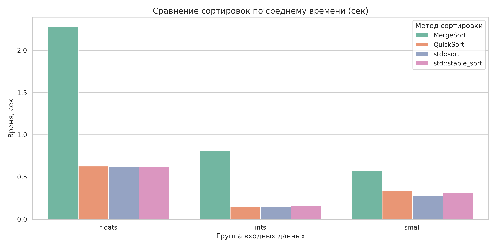

## Описание

В проекте реализованы две сортировки:

- **Внешняя сортировка слиянием (External Merge Sort)** — предназначена для обработки очень больших файлов, которые не помещаются в оперативную память. Файл разбивается на чанки по 100 МБ, каждый чанк сортируется параллельно с помощью пула потоков, затем все чанки сливаются в итоговый отсортированный файл.
- **Быстрая сортировка (Quick Sort)** — эффективна для сортировки относительно небольших файлов, которые помещаются в память.

Пользователь может выбрать нужный алгоритм сортировки через параметры командной строки.

Также проведено сравнение производительности обеих реализаций с алгоритмами стандартной библиотеки C++ (`std::sort`, `std::stable_sort`). Результаты бенчмарков и визуализация приведены в разделе benchmark.

> ⚠️ На малых объёмах данных (до сотен тысяч строк) внешний merge sort работает неэффективно — накладные расходы на файловые операции и многопоточность превышают выигрыш от сортировки.



---


## Использование

### 1. Генерация тестовых данных

В проекте есть три Python-скрипта для генерации файлов с разными типами данных:

- **generate_strings.py** — генерирует 1 000 000 случайных строк (от 5 до 15 символов):
  ```bash
  python3 generate_strings.py
  # создаст file.txt
  ```
- **generate_ints.py** — генерирует 1 000 000 случайных целых чисел:
  ```bash
  python3 generate_ints.py
  # создаст ints.txt
  ```
- **generate_floats.py** — генерирует 1 000 000 случайных float:
  ```bash
  python3 generate_floats.py
  # создаст floats.txt
  ```
- **benchmark/visualize_benchmark.py** - создание графика для бенчмарка 
  ```bash
    python3 -m venv .venv
    source .venv/bin/activate
    pip install pandas matplotlib seaborn
    python visualize_benchmark.py 
  ```
- **benchmark/stdsort.cpp** - сpp программа для бенчмарка std::sort/stable_sort
    ```bash
        g++ -O3 -std=c++20 stdsort.cpp -o stdsort
    ```

- **benchmark/benchmark.sh** - бенчмарк с помощью hyperfine
    - требует sudo прав
    - необходим csvkit


Параметры (количество, диапазон) можно изменить в соответствующих скриптах.

### 2. Сборка проекта

Для сборки используйте CMake:

```bash
mkdir build
cd build
cmake ..
make
```

```bash
cmake -S . -B build
cmake --build build
```

Будет создан исполняемый файл `sort`.


### 3. Запуск сортировки

Использование:

```bash
./sort [ -q | --quick | -m | --merge ] [ -a | --ascending | -d | --descending ] [ -i | --int | -f | --float | -s | --string ] <input_file> <output_file>
```

**Параметры:**
- `-q`, `--quick` — быстрая сортировка (QuickSort)
- `-m`, `--merge` — сортировка слиянием (MergeSort)
- `-a`, `--ascending` — по возрастанию (по умолчанию)
- `-d`, `--descending` — по убыванию
- `-i`, `--int` — сортировать целые числа
- `-f`, `--float` — сортировать числа с плавающей точкой
- `-s`, `--string` — сортировать строки
- `<input_file>` — путь к входному файлу
- `<output_file>` — путь к выходному файлу

**Примеры:**

Сортировка целых чисел по возрастанию слиянием:
```bash
./sort -m -a -i ints.txt sorted_ints.txt
```

Сортировка строк по убыванию быстрой сортировкой:
```bash
./sort --quick --descending --string file.txt sorted_strings.txt
```

---

---


---

## Примечания
- Размер чанка (100 МБ) можно изменить в исходном коде.
- Для очень больших файлов убедитесь, что на диске достаточно места для временных файлов.
- Для малых файлов используйте обычные сортировки — внешний merge sort эффективен только на гигабайтах данных.
