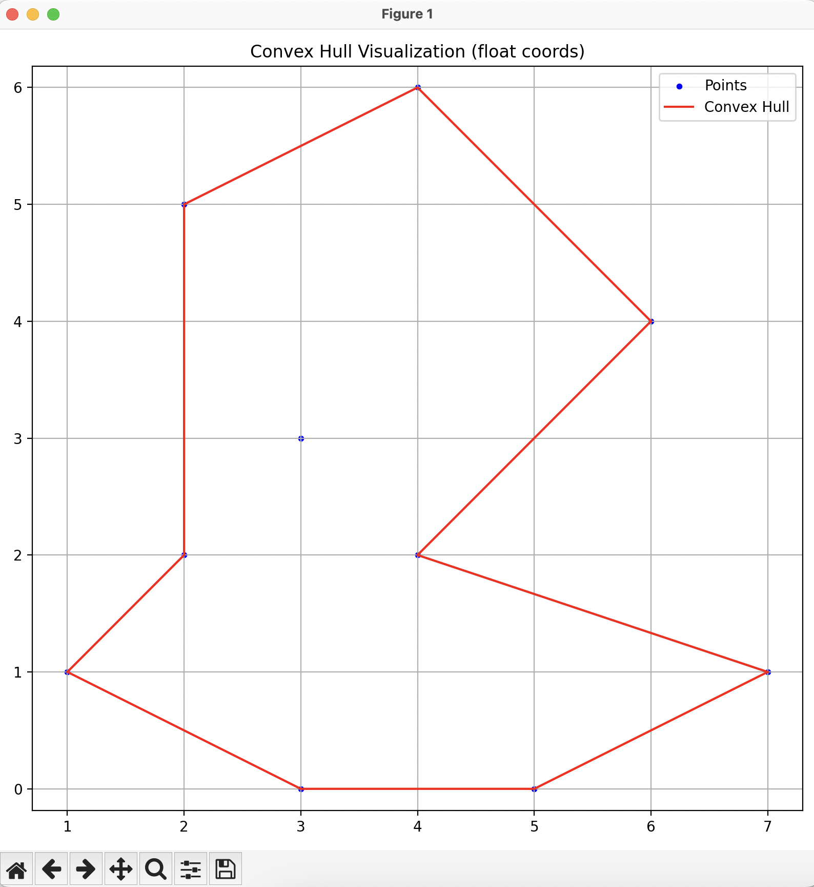

# ConcaveHull



Программа для построения вогнутой оболочки (concave hull) по набору точек на плоскости.

## Сборка

### Через CMake (рекомендуется)
```sh
cmake -S . -B build
cmake --build build
```
Исполняемый файл появится в папке `build` с именем `conh`.

### Одной командой (без CMake)
```sh
clang++ -std=c++20 -O2 -g ConcaveHull.cpp -o conh
```

## Использование

```sh
./conh <input.txt> <output.txt>
```

- **input.txt** — файл с точками, по одной паре координат (x y) в строке, через пробел.
- **output.txt** — файл, куда будет записан результат (координаты точек вогнутой оболочки, по одной паре на строку).

## Пример входного файла
```
1 2
1 5
2 3
2 4
3 3
3 4
4 2
4 5
```

## Пример запуска
```sh
./conh input.txt output.txt
```


## Визуализация

Для визуализации результата используйте скрипт drawConvexHull.py:

```sh
python3 drawConvexHull.py all_points.txt hull_points.txt
```

- **all_points.txt** — исходные точки (формат как во входном файле)
- **hull_points.txt** — результат работы программы (точки оболочки)

Скрипт отобразит все точки и построит ломаную по точкам оболочки.

## Описание
- Реализован алгоритм построения выпуклой и вогнутой оболочки.
- Поддерживается настройка параметра gamma для управления степенью вогнутости.
- Результат — список точек в порядке обхода оболочки.


